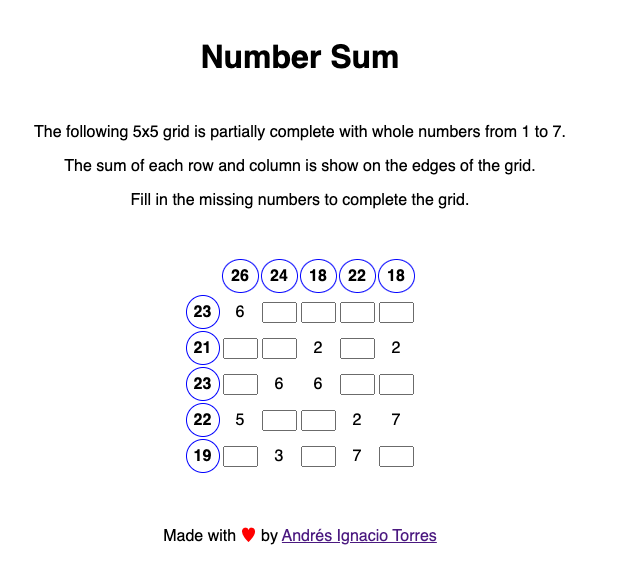

# Number Sum



`Number Sum` is a number guessing game built as a web application using Svelte. The game presents a grid partially filled with whole numbers.

You are tasked with completing the grid making sure that your input numbers add up to the hints shown for every
row and column.

## Motivation

I built this game in a few hours on a Sunday mostly due to two reasons:

1. I wanted to practice some Svelte, as the framework seemed interesting to me and I don't usually work on Javascript / Typescript-related codebases on my day-to-day job.
2. I played a similar game on my phone and it was plagued by obtrusive ads every couple clicks. I can do better than that!

## How to play?

You can play from any web browser by going to [numbersum.aitorres.com](https://numbersum.aitorres.com)!

The game is developed as a stateless, static web application. If you want to reset your match, you can
just refresh the page.

## Installation

If you want to install the web application locally, you will need `npm`.

Clone the repository, then run the following to start a development server:

```bash
npm run dev

# or start the server and open the app in a new browser tab
npm run dev -- --open
```

## Deployment

Since the app is a static website, you can run the following `npm` command to build the project.

```bash
npm run build
```

You can preview the production build with `npm run preview`.

Then, just copy the contents of the `build` folder to an appropriate web hosting.

## Contributing

Pull requests are welcome. For major changes, please open an issue first
to discuss what you would like to change.
